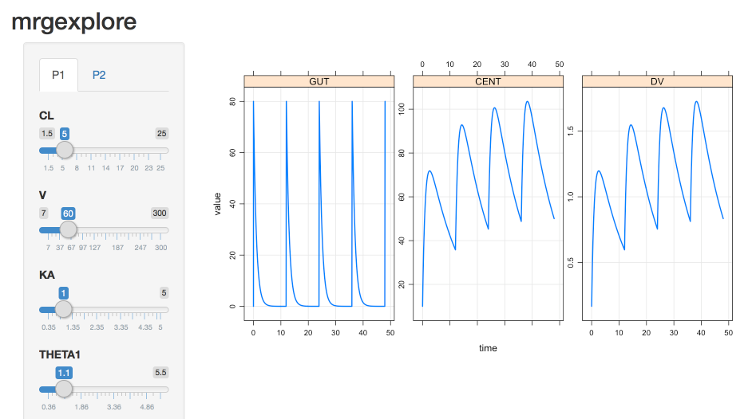

mrgexplore
=============

mrgexplore is a package to supplement mrgsolve in giving
the user the ability to create shiny apps with sliders to 
modify parameter values. This can provide insights to the 
parameter surface and can even provide a sort of sensitivity analysis.

It can be installed with

```
devtools::install_github("dpastoor/mrgexplore")
```

and assumes all dependencies required (such as rtools on windows) are set up and working for mrgsolve.


## Simple Example:

```r
library(dplyr)
library(mrgsolve)
library(mrgexplore)

one_cmt_f <- '
[SET] delta = 0.1, end=48

[PARAM] @annotated
CL : 5 : Clearance (L/hr)
V  : 60 : Volume of distribution (L)
KA : 1 : Absorption rate constant (1/hr)

[FIXED]  @annotated
F1 :  0.8 : Bioavailability fraction (.)

[THETA] @annotated
1.1  : Covariate AGE~CL (.)
0.32 : Covariate BMI~CL (.) 
5    : Covariate BMI~V  (.)

[CMT] @annotated
GUT : Dosing compartment (mg)

[INIT] @annotated
CENT : 10 : Central compartment (mg)

[OMEGA] @annotated @cor
ECL : 0     : IIV on CL
EV  : 0  0 : IIV on V

[MAIN]
double CLi = CL*exp(ECL);
double Vi  = V*exp(EV);
double KAi = KA;
F_GUT      = F1;

[PKMODEL] ncmt=1, depot=TRUE, trans=11

[TABLE]
double DV = CENT/V;

[CAPTURE] @annotated
DV : Plasma concentration (mg/L)
'
```

Once compiled the model can be piped around like
any other mrgsolve model, however instead of invoking
`mrgsim`, `mrgexplore` is used instead
```r
mod_one_cmt_f <- mcode("one_cmt_f", one_cmt_f)
mod_one_cmt_f %>%
   ev(amt = 100, addl = 6, ii = 12) %>%
   mrgexplore
```

Which will give you



For the moment it is quite simple, but will be expanded to
handle more complex scenarios and exploration techniques in the future.